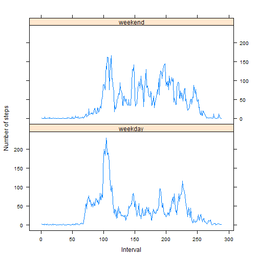

### Loading and preprocessing the data
Load the data.

```r
activity <- read.csv(unz("activity.zip", "activity.csv"), 
                 colClasses=c('integer','Date','integer'))
```

For the assignment, I used the lattice package. If you don't have it, install it.
Then load it into the current session:

```r
library(lattice)
```

### What is mean total number of steps taken per day?

First, let's create a list where each element corresponds to a day and includes a vector of steps made in this particular day. NA cases are ommited.

```r
completeActivity<-na.omit(activity)
lActivity<-split(completeActivity$steps,as.factor(completeActivity$date))
```

Then create a vector where each element is a sum of steps made per day and draw a hist.

```r
ssteps<-sapply(lActivity,sum)
hist(ssteps,col='blue',main='Steps per day',xlab='steps')
```

 

Calculate and report the mean and median total number of steps taken per day

```r
mean(ssteps)
```

```
## [1] 10766
```

```r
median(ssteps)
```

```
## [1] 10765
```

### What is the average daily activity pattern?
Make a time series plot (i.e. type = "l") of the 5-minute interval (x-axis) and the average number of steps taken, averaged across all days (y-axis)

```r
iActivity<-split(completeActivity$steps,as.factor(completeActivity$interval))
interAver<-sapply(iActivity,mean)
plot(interAver,type='l',xlab='interval',ylab='average number of steps')
```

 

Which 5-minute interval, on average across all the days in the dataset, contains the maximum number of steps?

```r
interAver[interAver[]==max(interAver)]
```

```
##   835 
## 206.2
```

Interval 835 contains the maximum average number of steps (206,17 steps).

###Imputing missing values
Calculate and report the total number of missing values in the dataset (i.e. the total number of rows with NAs)

```r
length(activity$steps[is.na(activity$steps)])
```

```
## [1] 2304
```

Create a new dataset that is equal to the original dataset but with the missing data filled in using the mean for 5-minute intervals.

```r
newActivity<-activity
for (i in seq_len(nrow(newActivity))) {
        if (is.na(newActivity$steps[i])) {
                newActivity$steps[i]<-interAver[as.character(newActivity$interval[i])] 
        }
}
head(newActivity,3)
```

```
##    steps       date interval
## 1 1.7170 2012-10-01        0
## 2 0.3396 2012-10-01        5
## 3 0.1321 2012-10-01       10
```

Make a histogram of the total number of steps taken each day and Calculate and report the mean and median total number of steps taken per day.

```r
lnewActivity<-split(newActivity$steps,as.factor(newActivity$date))
newssteps<-sapply(lnewActivity,sum)
hist(newssteps,col='green',main='Steps per day',xlab='steps')
```

 

```r
mean(newssteps)
```

```
## [1] 10766
```

```r
median(newssteps)
```

```
## [1] 10766
```

New values differ a bit from the estimates from the 1st part of the assignment.
After imputing missing values, the median and the mean became closer. Also, frequences are higher.

###Are there differences in activity patterns between weekdays and weekends?
Create a new factor variable in the dataset with two levels - "weekday" and "weekend" indicating whether a given date is a weekday or weekend day.

```r
newActivity$weekday<-sapply(newActivity$date, weekdays)
for (i in seq_len(nrow(newActivity))) {
        if (newActivity$weekday[i] %in% c('Saturday','Sunday')){
                newActivity$weekday[i]<-'weekend'
        } else {
                newActivity$weekday[i]<-'weekday'
        }
}
newActivity$weekday<-as.factor(newActivity$weekday)
str((newActivity$weekday))
```

```
##  Factor w/ 2 levels "weekday","weekend": 1 1 1 1 1 1 1 1 1 1 ...
```

```r
summary(newActivity$weekday)
```

```
## weekday weekend 
##   12960    4608
```

Make a panel plot containing a time series plot (i.e. type = "l") of the 5-minute interval (x-axis) and the average number of steps taken, averaged across all weekday days or weekend days (y-axis).

```r
nA<-subset(newActivity, select=-date)
nA<-aggregate(nA$steps, list(nA$weekday,as.factor(nA$interval)),mean,data=nA)
colnames(nA)<-(c('weekday','interval','av_steps'))
xyplot(av_steps~as.numeric(interval)|weekday, data=nA, layout=c(1,2),type='a',xlab='Interval',ylab='Number of steps')
```

 
